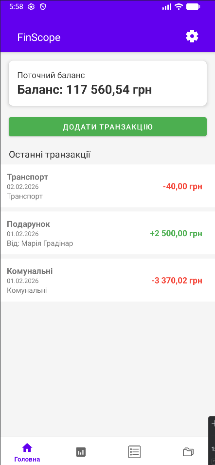
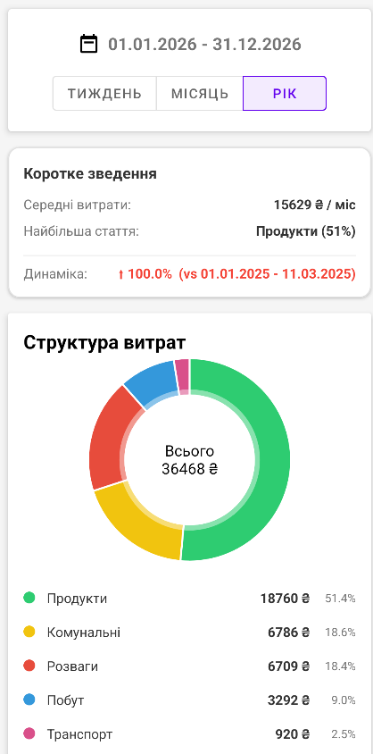
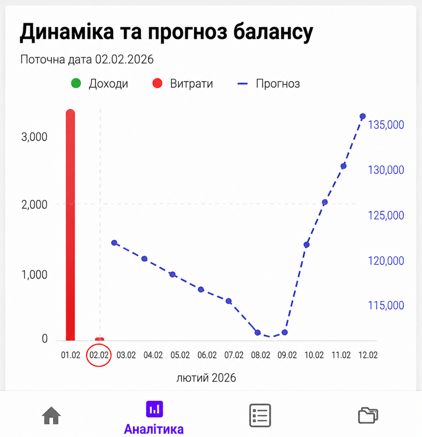
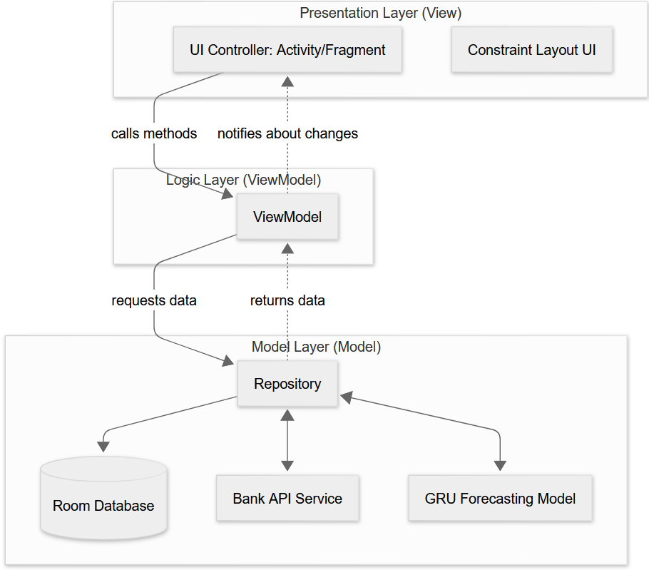

# FinScope

FinScope is an Android application designed for personal financial management and automated cash-flow forecasting. It pairs daily transaction tracking with a recurrent neural network model to evaluate historical spending behavior and project future balance trajectories.

The application is built offline-first: all user records are stored and processed locally on the device, ensuring privacy and full access without requiring an active network connection.

---

## Motivation

Most personal finance tools either limit themselves to retrospective expense tracking or require manual spreadsheets that fail to capture spending habits over time.

FinScope was built to bridge this gap by treating financial transactions as sequential time-series data. By modeling historical cash-flow patterns directly on the device, the app helps users anticipate balance drawdowns, track spending velocity, and plan ahead before liquidity dips occur.

---

## Application Walkthrough

### Transaction Tracking
The main dashboard displays the current account balance and a chronological feed of recent transactions, with income and expense entries color-coded for quick overview. A primary action button enables direct logging of new transactions with custom categories, notes, and amounts, while a persistent bottom navigation bar provides fast access between modules.

<p align="center">
  
</p>

### Financial Analytics
The analytics screen breaks down expenditure patterns across configurable time horizons (Weekly, Monthly, Annual). It computes high-level financial metrics including monthly average spend, dominant category share, and period-over-period trend analysis. Category distributions are rendered as an interactive donut chart using MPAndroidChart with exact sums and percentage splits.

<p align="center">
  
</p>

### Balance Dynamics & ML Forecasting
The forecasting screen combines historical cash flow with machine learning projections on a dual-axis chart. Historical income and expense transactions are displayed alongside a forward-looking balance trajectory generated by the GRU neural network. By analyzing past recurring patterns and current spending velocity, the model estimates daily balance movements for upcoming dates, helping users anticipate cash flow dips and adjust discretionary spending in advance.

<p align="center">
  
</p>

---

## Architecture & System Design

FinScope is built on the Model-View-ViewModel (MVVM) pattern combined with a Repository layer to decouple the user interface from business logic and data persistence.

<p align="center">
  
</p>

The presentation layer consists of Activities and Fragments built with ConstraintLayout. These components observe state changes emitted by the ViewModel and handle user interactions without managing business decisions.

The ViewModel manages UI-related state and coordinates data flow between the user interface and the backend layers. It holds no references to Android Context or view lifecycles, ensuring state preservation across configuration changes.

At the base of the architecture, the Repository acts as the single source of truth for the entire application. It resolves queries from the ViewModel by orchestrating multiple data providers: a local SQLite database accessed via Room for persistent storage, an external Bank API service layer designed for transaction feed synchronization, and the GRU forecasting module for on-device inference.

---

## Machine Learning Pipeline

Cash flow and balance forecasting relies on a Gated Recurrent Unit (GRU) neural network. A recurrent architecture was chosen over standard regression because personal financial transactions exhibit clear temporal dependencies, periodicity, and recurring billing cycles.

The model was trained and evaluated on anonymized sequential transaction data combined with synthetic cyclical patterns to simulate realistic recurring income, scheduled bills, and irregular discretionary spendings. The training pipeline was implemented in Python using TensorFlow, Keras, NumPy, and Pandas. Historical transaction logs were aggregated into daily intervals, tracked across cash-flow dimensions, and normalized.

The network processes sequential inputs through sliding time windows to map historical spending velocity and recurring events to future balance trajectories. Once trained, the model was integrated into the application's data layer, enabling the repository to generate projections directly from local Room database records without transmitting personal financial data to external servers.

---

## Implementation Details

The Android client is implemented in Kotlin with asynchronous routines handled via Coroutines and Flow. Local data storage relies on Room ORM over SQLite, maintaining indices across timestamps and categories for fast analytical queries.

The machine learning and data preparation workflows were developed in Python using Pandas and Scikit-Learn for preprocessing, alongside TensorFlow for network definition and training.

---

## Getting Started

### Prerequisites
* Android Studio (recent stable release)
* Android SDK 34 (minimum SDK supported: 24)
* JDK 17

### Installation & Run
1. Clone the repository:
   ```bash
   git clone https://github.com/Vlad6778/FinScope.git
2. Open the project folder in Android Studio.
3. Allow Gradle to download dependencies and finish indexing.
4. Launch the application on an Android device or emulator running API level 24 or higher.

---

## Author

Vladyslav Deviatkov  
Email: vlad.devyatkov67@gmail.com  
GitHub: [@Vlad6778](https://github.com/Vlad6778)

---

## License

This project is licensed under the MIT License. See the LICENSE file for details.
